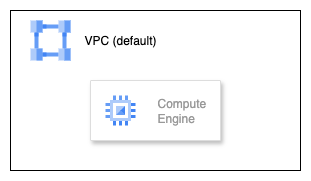

# GC-terraform-introduction

Google Cloud の基礎を Terraform でハンズオンするためのリポジトリです。Compute Engine のインスタンスを作成・削除する最小構成を題材に、`gcloud` CLI の初期セットアップから `terraform destroy` による後片付けまでをまとめています。対象記事の「terraform.tfstate を Cloud Storage に保存する」手前までをカバーします。

## 構成図


## ディレクトリ構成
- `modules/setup` : Compute Engine インスタンスを作成するモジュール
- `environments/{dev,stg,prd}` : 環境ごとのルートモジュール。`variables.tf` でプロジェクトやリージョンを指定します
- `docs/` : 図版などドキュメント類

## 事前準備
- 課金が有効になっている Google Cloud プロジェクト
- Terraform 1.5 以降（`terraform -version` で確認できます）
- Google Cloud SDK (`gcloud` CLI)
- 権限が十分なアカウント（プロジェクトオーナー、もしくは少なくとも Compute Admin 相当）

## gcloud CLI セットアップ
1. Google Cloud SDK をインストールします。macOS の場合は `brew install --cask google-cloud-sdk`、その他の環境は公式ドキュメントに従ってください。
2. ターミナルで `gcloud version` を実行し、 SDK が利用可能になっていることを確認します。
3. `gcloud init` を実行してブラウザでログインし、今回使用するプロジェクトを選択します。
4. `gcloud config set project <PROJECT_ID>` で明示的にプロジェクトを設定します。
5. Terraform から利用する資格情報を作るため `gcloud auth application-default login` を実行し、Application Default Credentials を作成します。サービスアカウント鍵を使う場合は JSON を取得し、`GOOGLE_APPLICATION_CREDENTIALS` 環境変数でパスを指定してください。
6. デフォルトのリージョンとゾーンを設定します。
```bash
gcloud config set compute/region asia-northeast1
gcloud config set compute/zone asia-northeast1-a
```
7. Compute Engine API を有効化します。
```bash
gcloud services enable compute.googleapis.com
```
8. `gcloud auth list` でアクティブなアカウントを確認できれば準備完了です。

## Terraform の実行
### Terraform の準備
1. このリポジトリを任意の場所にクローンし、`GC-terraform-introduction` ディレクトリに移動します。
```bash
git clone <your-fork-or-clone-url>
cd GC-terraform-introduction
```
2. 利用する環境ディレクトリ（例：`environments/dev`）に移動します。
```bash
cd environments/dev
```
3. `variables.tf` の `project_id` を自身のプロジェクト ID に書き換え、必要であれば `region` や `environment` も更新します。変数ファイルを直接編集したくない場合は `terraform.tfvars` を作成し、同じキーを定義しても構いません。
4. Terraform の初期化とコード整形を行います。
```bash
terraform fmt
terraform init
```
5. 実行計画を確認します。
```bash
terraform plan
```
6. 問題がなければリソースを作成します。
```bash
terraform apply
# 自動承認したい場合は terraform apply -auto-approve
```
7. 適用後は `gcloud compute instances list` で VM が作成されていることを確認できます。Terraform の状態ファイル (`terraform.tfstate`) は環境ディレクトリに出力されるため、誤ってコミットしないよう注意してください。

### 後片付け（terraform destroy）
1. リソースを削除する前に、現在の状態を再度確認する場合は `terraform plan -destroy` を実行します。
2. 作成したリソースをすべて削除します。
```bash
terraform destroy
# または terraform destroy -auto-approve
```
3. 削除完了後、`gcloud compute instances list` でインスタンスが存在しないことを確認してください。

## 補足
- 環境を切り替える場合は `environments/stg` や `environments/prd` に移動し、同様の手順を実行します。
- 認証情報を切り替える際は `gcloud auth application-default login` を再実行するか、`gcloud auth application-default revoke` で一度削除してから設定し直してください。
- 追加の API を有効化する場合は `gcloud services enable <API_NAME>` を実行します。`compute.googleapis.com` が有効になっていれば、このハンズオンは実行できます。

## 参考
[Terraform で入門する Google Cloud【セットアップ編】](https://zenn.dev/oyasumipants/articles/8f0ac1a3395520)
